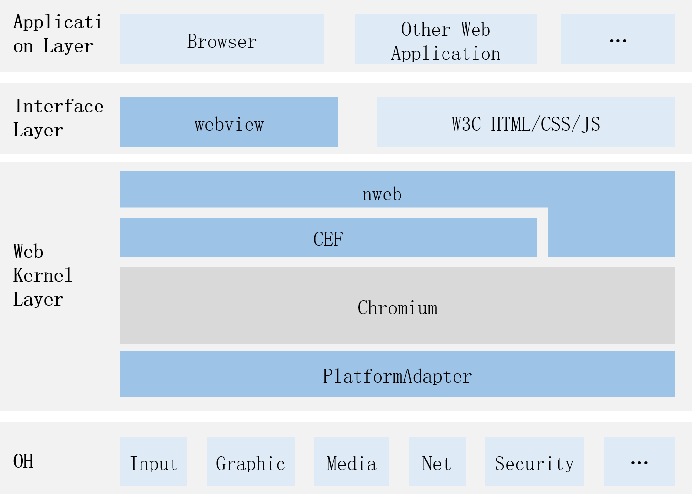

# Chromium
## Introduction
1. Chromium is an open-source web browser principally developed by Google and from which Google Chrome draws its source code. It is released under the BSD license and other permissive open-source licenses, aiming to build a safer, faster and more stable way to experience the Internet.
2. OpenHarmony nweb is built on Chromium.
## Software Architecture
Below is the software architecture.

* Webview component: UI component in OpenHarmony.
* nweb: native engine of the OpenHarmony web component, which is built based on the Chromium Embedded Framework (CEF).
* CEF: stands for Chromium Embedded Framework. It is an open-source project based on Google Chromium.
* Chromium: an open-source web browser principally developed by Google and released under the BSD license and other permissive open-source licenses.
## Directory Structure
```
.
└── patch                      # patch directory customized for Chromium and used to build nwebview
```
## Usage
1. Run **./init_chromium.sh** to initialize the source code.
* Download the Google tool set depot_tools.
* Obtain the Chromium source code and download the third-party libraries on which Chromium depends.
* Based on the source code, add nweb build modifications, including adding CEF code, adapting OpenHarmony compilation and build, nweb build source code, Chromium vulnerability patching, and nweb bug fixes.
* *Note 1: For details about the CEF, visit [third_party_cef](https://gitee.com/openharmony/third_party_cef)*.
2. Compile the OpenHarmony image of the RK3568 platform in full mode. When the compilation is successful, perform step 3 to compile the nweb component in OpenHarmony.
* *Note 2: For details about how to build the OpenHarmony image of the RK3568 platform, see [RK3568 Build Guidelines](https://gitee.com/openharmony/docs/blob/master/zh-cn/device-dev/quick-start/quickstart-standard-running-rk3568-build.md).*
3. Run **./build.sh -gn** to build the source code.
4. Use DevEco Studio to package the build target into **NWeb.hap**, and run **hdc_std install NWeb.hap** to install **NWeb.hap** on RK3568. To download DevEco Studio, visit https://hmxt.org/deveco-studio.
## Repositories Involved
[ace_ace_engine](https://gitee.com/openharmony/ace_ace_engine)

[third_party_cef](https://gitee.com/openharmony/third_party_cef)

[web_webview](https://gitee.com/openharmony/web_webview)

**[third_party_chromium](https://gitee.com/openharmony/third_party_chromium)**
