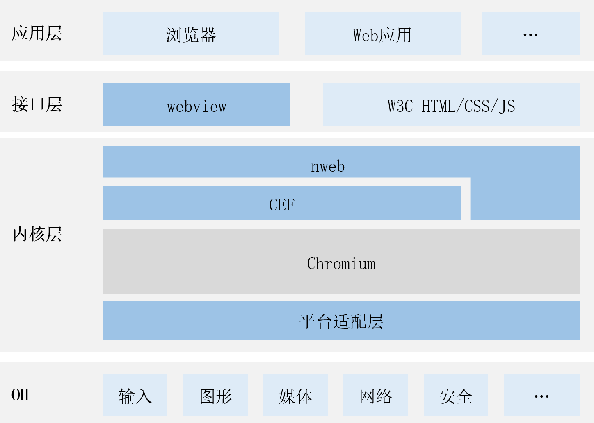

# chromium
- [简介](#简介)
- [目录](#目录)
- [使用说明](#使用说明)
- [相关仓](#相关仓)
## 简介
### 内容介绍
1. Chromium是由Google主导开发的网页浏览器，以BSD许可证等多重自由版权发行并开放源代码，是Google的Chrome浏览器背后的引擎，其目的是为了创建一个安全、稳定和快速的通用浏览器。
2. OpenHarmony nweb基于Chromium构建。
### 软件架构
软件架构说明

* webview组件：OpenHarmony的UI组件。
* nweb：基于CEF构建的OpenHarmony web组件的Native引擎。
* CEF：CEF全称Chromium Embedded Framework，是一个基于Google Chromium 的开源项目。
* Chromium： Chromium是一个由Google主导开发的网页浏览器，以BSD许可证等多重自由版权发行并开放源代码。
## 目录
```
.
└── patch                      # 构建nwebview，针对chromium修改的patch目录
```
## 使用说明
1. 执行./init_chromium.sh，初始化源代码，主要做以下几步
* 下载google工具集depot_tools。
* 拉取chromium源码，下载chromium依赖的相关三方库
* 在源代码基础上增加针对nweb的构建修改，主要包括：增加cef代码，openharmony编译构建适配，nweb构建源码，chromium漏洞补丁以及nweb的bugfix修改。
*注1：关于cef的介绍，可以访问cef仓：[third_party_cef](https://gitee.com/openharmony/third_party_cef)*
2. 全量编译RK3568平台openharmony镜像，成功后，再执行第三步编译基于openharmony平台的nweb组件。
*注2：关于如何构建RK3568平台openharmony镜像，可以访问：[RK3568编译指导](https://gitee.com/openharmony/docs/blob/master/zh-cn/device-dev/quick-start/quickstart-ide-3568-build.md)*
3. 执行./build.sh -gn，编译源码。
4. 通过DevEco studio将编译目标打包成NWeb.hap，使用hdc_std install NWeb.hap安装至RK3568，IDE下载可访问：[下载官网](https://hmxt.org/deveco-studio)
## 相关仓
[ace_ace_engine](https://gitee.com/openharmony/ace_ace_engine)

[third_party_cef](https://gitee.com/openharmony/third_party_cef)

[web_webview](https://gitee.com/openharmony/web_webview)

**[third_party_chromium](https://gitee.com/openharmony/third_party_chromium)**
